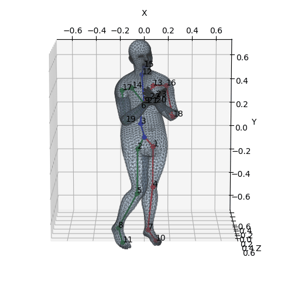
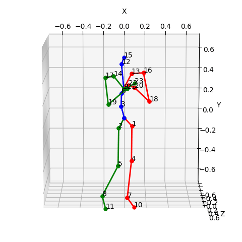

pose2smpl
=======

### Fitting SMPL Parameters by 3D-pose Key-points

The repository provides a tool to fit **SMPL parameters** from **3D-pose** datasets that contain key-points of human body.

The SMPL human body layer for Pytorch is from the [smplpytorch](https://github.com/gulvarol/smplpytorch) repository.

<p align="center">


</p>

## Setup

### 1. The `smplpytorch` package
* **Run without installing:** You will need to install the dependencies listed in [environment.yml](environment.yml):
  
  * `conda env update -f environment.yml` in an existing environment, or
  * `conda env create -f environment.yml`, for a new `smplpytorch` environment
* **Install:** To import `SMPL_Layer` in another project with `from smplpytorch.pytorch.smpl_layer import SMPL_Layer` do one of the following.
  
  * Option 1: This should automatically install the dependencies.
    ``` bash
    git clone https://github.com/gulvarol/smplpytorch.git
    cd smplpytorch
    pip install .
    ```
  * Option 2: You can install `smplpytorch` from [PyPI](https://pypi.org/project/smplpytorch/). Additionally, you might need to install [chumpy](https://github.com/hassony2/chumpy.git).
    ``` bash
    pip install smplpytorch
    ```

### 2. Download SMPL pickle files
  * Download the models from the [SMPL website](http://smpl.is.tue.mpg.de/) by choosing "SMPL for Python users". Note that you need to comply with the [SMPL model license](http://smpl.is.tue.mpg.de/license_model).
  * Extract and copy the `models` folder into the `smplpytorch/native/` folder (or set the `model_root` parameter accordingly).

### 3. Download Dataset

- Download the datasets you want to fit

    currently support:

    - [HumanAct12](https://ericguo5513.github.io/action-to-motion/)
    - [CMU Mocap](https://ericguo5513.github.io/action-to-motion/)
    - [UTD-MHAD](https://personal.utdallas.edu/~kehtar/UTD-MHAD.html)
    - [Human3.6M](http://vision.imar.ro/human3.6m/description.php)
    
- Set the **DATASET.PATH** in the corresponding configuration file to the location of dataset.

## Fitting

### 1. Executing Code

You can start the fitting procedure by the following code and the configuration file in *fit/configs* corresponding to the dataset_name will be loaded (the dataset_path can also be set in the configuration file):

```
python fit/tools/main.py --dataset_name [DATASET NAME] --dataset_path [DATASET PATH]
```

### 2. Output

- **Direction**: The output SMPL parameters will be stored in *fit/output*

- **Format:** The output are *.pkl* files, and the data format is:

    ```
    {
    	"label": [The label of action],
    	"pose_params": pose parameters of SMPL (shape = [frame_num, 72]),
    	"shape_params": pose parameters of SMPL (shape = [frame_num, 10]),
    	"Jtr": key-point coordinates of SMPL model (shape = [frame_num, 24, 3])
    }
    ```

    
